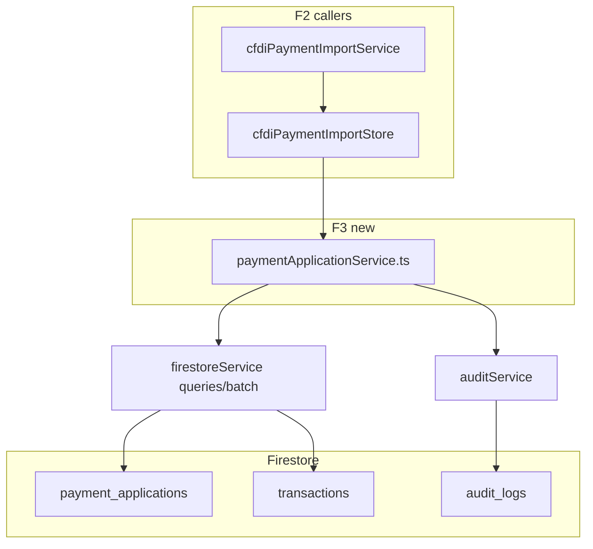

# Implementation Plan — Entregable 9.2 · Fase F3 (Persistencia + Rules + Índices)

**Proyecto:** ContAI Fase 4  
**Fecha:** 2026-08-25  
**Estado:** **BORRADOR F3 — pendiente aprobación explícita antes de escribir código**  
**Pre-requisito:** F0–F2 ✅ cerrados en `main` (`bcb1d05`)  
**Commit objetivo (post-aprobación):** `feat(E9.2-F3): payment applications service, rules and indexes`

**Alcance estricto:** capa de datos y seguridad. **Sin UI (F4) ni Groq (F5).**

---

## 1. Diagnóstico post-F2 (qué existe vs qué falta)

### 1.1 Implementado en F2 (base reutilizable)

| Pieza | Ubicación | Estado |
|-------|-----------|--------|
| Guards monetarios | `src/types/paymentApplication.ts` | ✅ `roundMoney`, `assertValidPaymentApplications`, `computeSaldoPendiente` |
| Lógica auto-aplicación tipo P | `src/services/cfdiPaymentImportService.ts` | ✅ `evaluateTipoPAutoApply`, idempotencia vía store |
| WriteBatch provisional | `src/services/firestoreService.ts` | ✅ `commitPaymentApplicationsBatch`, `hasPaymentApplicationsForSource`, `findTransactionsByCfdiUuids` |
| Adaptador store | `src/services/cfdiPaymentImportStore.ts` | ✅ delega a `firestoreService` |
| Schema TX SAT | `src/types/transactionSat.ts` + drafts | ✅ campos merge-only |
| Tests lógica import | `cfdiPaymentImportService.test.ts` | ✅ 11 tests (140 suite total) |

### 1.2 Gaps F3 (violaciones arquitectura / seguridad)

1. **No existe `paymentApplicationService.ts`** — persistencia vive en `firestoreService.ts` (God-adjacent; viola SRP del plan E9.2).
2. **Sin Firestore Rules** para `payment_applications` → escrituras desde cliente potencialmente abiertas tras deploy.
3. **Sin índices compuestos** `organization_id + source_id` / `organization_id + target_transaction_id` → queries idempotencia/listado fallarán en prod.
4. **Inmutabilidad post-confirmación** no enforced en rules (`update/delete` debería ser `false` en MVP).
5. **Índice auxiliar** `transactions`: `organization_id + cfdi_uuid` (query F2) — no declarado en `firestore.indexes.json`.
6. **Sin tests** del servicio canónico de persistencia ni de rules.

### 1.3 Refactor obligatorio F3 (no scope creep)

Consolidar la persistencia en **`paymentApplicationService.ts`** y hacer que:
- `cfdiPaymentImportStore` → llame al servicio canónico (no `commitPaymentApplicationsBatch` directo).
- `firestoreService.ts` → conserve solo primitivas genéricas (`commitTransactionUpdatesBatch`, queries) **o** wrappers finos invocados exclusivamente por `paymentApplicationService`.

---

## 2. Objetivo F3

Exponer **`confirmPaymentApplications`** como único punto de escritura de aplicaciones de pago, con:

1. Validación de negocio (guards F1/F2) antes del batch.
2. Idempotencia (`source_id` = UUID complemento P o id movimiento banco).
3. **Un `writeBatch` atómico**: N docs `payment_applications` + M patches `transactions`.
4. Audit log `PAYMENT_APPLICATION_CONFIRMED`.
5. Rules + indexes desplegables en `contai-15259`.

---

## 3. Grafo de impacto (F3 only)



**Fuera de alcance F3:** `PaymentApplicationPanel`, `usePaymentApplications`, `groqAIService.proposePaymentApplications`.

---

## 4. Diseño `paymentApplicationService.ts`

### 4.1 API pública

```typescript
export type ConfirmPaymentApplicationsInput = {
  organizationId: string;
  userId: string;
  sourceType: 'cfdi_pago' | 'bank_movement' | 'manual';
  sourceId: string;              // UUID CFDI P o bank_movement_id
  paymentTransactionId?: string; // TX tipo P (opcional si source es banco)
  applications: PaymentApplicationDraft[];
  /** Snapshot targets para validar saldo (pre-check MVP concurrency) */
  targets: Array<{
    transactionId: string;
    montoOriginal: number;
    saldoPendiente: number;
    appliedPaymentAmount: number;
    fecha: string;
  }>;
  sourceAmount: number;
  periodosCerrados?: string[];
  cfdiUuidByTarget?: Record<string, string>;
};

export type ConfirmPaymentApplicationsResult =
  | { ok: true; applicationCount: number; applicationIds: string[] }
  | { ok: false; error: string; code: 'IDEMPOTENT' | 'VALIDATION' | 'CLOSED_PERIOD' };
```

### 4.2 Función canónica `confirmPaymentApplications`

**Pasos (orden fijo):**

1. **Idempotencia:** `hasPaymentApplicationsForSource(orgId, sourceId)` → si true, `{ ok: false, code: 'IDEMPOTENT' }` (o `{ ok: true, applicationCount: 0 }` según contrato acordado con F2 — **recomendación:** mantener semántica F2 `already_processed` en caller, servicio retorna error tipado).
2. **Validación Σ:** `assertValidPaymentApplications({ sourceAmount, applications })`.
3. **Validación saldo:** por cada app, `assertApplicationWithinSaldo` contra snapshot `targets`.
4. **Periodo cerrado:** si `periodosCerrados` presente, rechazar targets en periodo cerrado → `CLOSED_PERIOD`.
5. **Normalizar montos:** `roundMoney` en todos los amounts.
6. **Construir batch:**
   - `batch.set` → `payment_applications/{autoId}` con schema §4.3.
   - `batch.set(..., { merge: true })` → cada `transactions/{targetId}` con `saldo_pendiente`, `payment_status`, `applied_payment_amount`, `monto_original`, `actualizado_en`.
7. **`batch.commit()`** — single batch si ≤500 ops (límite Firestore); si >500, chunking documentado (igual patrón `BATCH_CHUNK` E9.1).
8. **Audit:** `logAuditEntry('PAYMENT_APPLICATION_CONFIRMED', 'payment_applications', { ... })`.

### 4.3 Schema persistido `payment_applications`

Alineado a `PaymentApplicationDoc` + campos F2:

| Campo | Tipo | Notas |
|-------|------|-------|
| `organization_id` | string | obligatorio |
| `usuario_id` | string | obligatorio en create |
| `source_type` | string | `cfdi_pago` \| `bank_movement` \| `manual` |
| `source_id` | string | UUID CFDI o id movimiento |
| `payment_transaction_id` | string? | TX complemento P |
| `target_transaction_id` | string | factura PPD |
| `amount` | number | 2 decimales |
| `cfdi_uuid_relacionado` | string? | DoctoRelacionado |
| `creado_en` | timestamp | server |

**Invariante post-write TX target:**
```typescript
saldo_pendiente = Math.max(0, roundMoney(monto_original - applied_payment_amount))
payment_status = derivePaymentStatus(monto_original, applied_payment_amount)
```

### 4.4 Helpers de lectura (permanecen en `firestoreService.ts`)

| Función | Uso |
|---------|-----|
| `hasPaymentApplicationsForSource` | Idempotencia |
| `findTransactionsByCfdiUuids` | Resolver UUID → TX (import tipo P) |
| `listPaymentApplicationsByTarget` | **nuevo** — listar apps de una factura (prep F4, solo query) |
| `listPaymentApplicationsBySource` | **nuevo** — audit/debug |

---

## 5. Firestore Rules (`payment_applications`)

Patrón **E9.1 / `bank_allocations`** + inmutabilidad MVP:

```
match /payment_applications/{applicationId} {
  allow read: if isAuthenticated()
    && canReadOrg(resource.data.organization_id);

  allow create: if isAuthenticated()
    && request.resource.data.usuario_id == request.auth.uid
    && canWriteOrgData(request.resource.data.organization_id)
    && request.resource.data.organization_id is string
    && request.resource.data.source_id is string
    && request.resource.data.target_transaction_id is string
    && request.resource.data.amount is number
    && request.resource.data.amount > 0
    && request.resource.data.source_type in ['cfdi_pago', 'bank_movement', 'manual'];

  // MVP: aplicaciones inmutables tras confirmación (evita tampering amount/target)
  allow update, delete: if false;
}
```

**Notas:**
- No validar `amount` con `roundMoney` en rules (imposible); la validación fina queda en servicio.
- `organization_id` inmutable en updates → N/A porque update=false.
- Deploy rules **solo tras aprobación F3** (`firebase deploy --only firestore:rules,firestore:indexes`).

---

## 6. Firestore Indexes (`firestore.indexes.json`)

Añadir:

```json
{
  "collectionGroup": "payment_applications",
  "queryScope": "COLLECTION",
  "fields": [
    { "fieldPath": "organization_id", "order": "ASCENDING" },
    { "fieldPath": "source_id", "order": "ASCENDING" }
  ]
},
{
  "collectionGroup": "payment_applications",
  "queryScope": "COLLECTION",
  "fields": [
    { "fieldPath": "organization_id", "order": "ASCENDING" },
    { "fieldPath": "target_transaction_id", "order": "ASCENDING" }
  ]
},
{
  "collectionGroup": "transactions",
  "queryScope": "COLLECTION",
  "fields": [
    { "fieldPath": "organization_id", "order": "ASCENDING" },
    { "fieldPath": "cfdi_uuid", "order": "ASCENDING" }
  ]
}
```

*(El tercer índice soporta `findTransactionsByCfdiUuids` del pipeline F2.)*

---

## 7. Archivos a crear

| Ruta | Responsabilidad única |
|------|------------------------|
| `src/services/paymentApplicationService.ts` | `confirmPaymentApplications`, validación, orchestration batch + audit |
| `src/services/paymentApplicationService.test.ts` | Unit puro: batch payload, guards, idempotencia, periodo cerrado (mock store) |
| `src/services/firestoreRules.paymentApplications.test.ts` | Validación rules vía `@firebase/rules-unit-testing` **o** script Node mínimo con emulador |

---

## 8. Archivos a modificar

| Ruta | Cambio |
|------|--------|
| `src/services/firestoreService.ts` | Extraer lógica batch a servicio; mantener queries; opcional deprecar `commitPaymentApplicationsBatch` público |
| `src/services/cfdiPaymentImportStore.ts` | Delegar writes a `confirmPaymentApplications` |
| `src/services/cfdiPaymentImportService.ts` | Sin cambio de contrato externo; store usa servicio F3 |
| `firestore.rules` | Bloque `payment_applications` §5 |
| `firestore.indexes.json` | 3 índices §6 |
| `implementation_plan.md` | Estado post-F3 |
| `package.json` | Solo si se adopta `@firebase/rules-unit-testing` (devDependency) |

**Sin tocar:** componentes UI, hooks, `groqAIService.ts`, `bankAllocationService.ts`.

---

## 9. Estrategia de pruebas F3

### 9.1 Unitarios `paymentApplicationService.test.ts` (obligatorios)

| Caso | Verificación |
|------|--------------|
| Batch construye N apps + M TX patches | Mock `writeBatch`; assert ops count |
| Rechaza Σ ≠ sourceAmount | `VALIDATION` |
| Rechaza overflow saldo | `VALIDATION` |
| Idempotencia: skip si `hasApplicationsForSource` | `IDEMPOTENT` |
| Periodo cerrado en target | `CLOSED_PERIOD` |
| Montos normalizados con `roundMoney` | amounts en payload |
| Audit `PAYMENT_APPLICATION_CONFIRMED` | mock `logAuditEntry` |

### 9.2 Rules (obligatorio — enfoque mínimo)

**Opción A (recomendada MVP):** `@firebase/rules-unit-testing` + emulador Firestore en CI local.

| Caso | Verificación |
|------|--------------|
| Miembro org A crea app en org A | allow create |
| Usuario org B no lee app org A | deny read |
| Update/delete application | deny |
| Create sin `usuario_id` match | deny |

**Opción B (fallback):** documentar casos + validación manual en staging si emulador no entra en F3 (requiere aprobación explícita del auditor).

### 9.3 Regresión

- `npm test` — suite ≥140, sin regresión F2.
- `npm run lint` — `tsc --noEmit`.
- `cfdiPaymentImportService.test.ts` — verde sin cambios de comportamiento.

---

## 10. Efectos secundarios explícitos

1. **F2 import tipo P:** misma semántica externa; cambia solo el callee interno (`confirmPaymentApplications`).
2. **Deploy obligatorio** rules+indexes antes de probar en `contai-15259` con cliente real.
3. **Colección `payment_applications`** pasa de “escritura implícita sin rules” a “protegida + inmutable”.
4. **Prep F4:** queries `listPaymentApplicationsByTarget` listas para panel manual.

---

## 11. Criterios de aceptación F3 (Definition of Done)

- [x] `paymentApplicationService.confirmPaymentApplications` implementado con writeBatch atómico.
- [x] Idempotencia por `source_id` integrada en servicio (`status: 'already_processed'`).
- [x] Audit `PAYMENT_APPLICATION_CONFIRMED` en confirmación exitosa.
- [x] `cfdiPaymentImportStore` usa servicio canónico (no batch directo).
- [x] Rules `payment_applications` en repo; `update/delete: false`.
- [x] Índices §6 en repo (deploy pendiente a `contai-15259`).
- [x] 9 tests unitarios servicio + 6 tests rules (`npm run test:rules`).
- [x] Suite total 149 tests + 6 rules (155), `tsc` OK.
- [x] **Cero** archivos UI/Groq modificados.

---

## 12. Gobernanza roadmap

| Fase | Estado |
|------|--------|
| E9.2 F0–F2 | ✅ `bcb1d05` |
| **E9.2 F3** | ✅ **IMPLEMENTADO** — pendiente commit + deploy rules/indexes |
| **E9.2 F4** | **SIGUIENTE** — UI `PaymentApplicationPanel` + hook |
| E9.2 F5 | Groq `proposePaymentApplications` + audit AI |
| E10.x / E11.1 | Parked |

**Tras commit F3:** deploy rules/indexes → evidencia auditor → luz verde F4.

---

## 13. Preguntas críticas (respuesta o confirmación MVP)

1. **Idempotencia en servicio:** ¿Retornar `{ ok: false, code: 'IDEMPOTENT' }` o `{ ok: true, applicationCount: 0 }`?  
   - *Recomendación:* mantener `{ code: 'IDEMPOTENT' }` para trazabilidad; caller F2 mapea a `already_processed`.

2. **Rules `update: false`:** ¿Confirmar inmutabilidad total en MVP (sin corrección admin)?  
   - *Recomendación:* sí, alineado al auditor.

3. **Rules-unit-testing:** ¿Autorizar devDependency + script `npm run test:rules`?  
   - *Recomendación:* sí, costo bajo, alto valor.

---

## 14. Estado de ejecución

**F3 implementado** (ago 2026). Respuestas §13 confirmadas por auditor:
1. Idempotencia → `{ status: 'already_processed' }` (unión discriminada).
2. Rules inmutables → `update, delete: if false`.
3. `@firebase/rules-unit-testing@5` + `npm run test:rules`.

**Pendiente post-implementación:** commit, deploy `firestore.rules` + `firestore.indexes.json`, plan F4.
