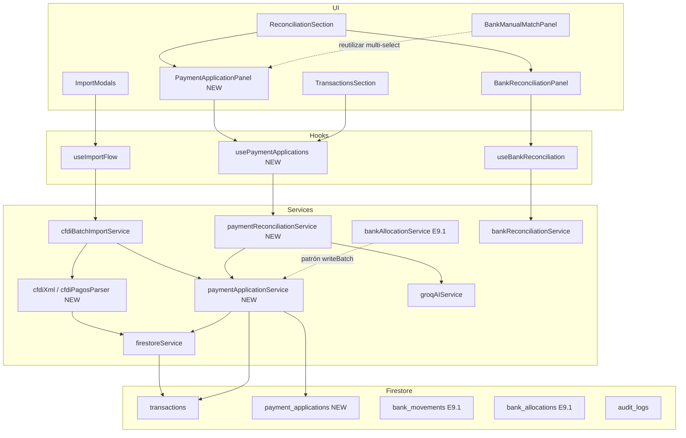

# Implementation Plan — Entregable 9.2 (Globales SAT + Anticipos)

**Proyecto:** ContAI Fase 4  
**Fecha:** 2026-08-25  
**Estado:** F0 + F1 ✅ · **F2 ✅ APROBADO** (commit autorizado) · F3–F5 pendientes  
**Commit objetivo F2:** `feat(E9.2-F2): SAT import pipeline PPD/global/tipo P with payment idempotency`

---

## 1. Diagnóstico técnico actual

### 1.1 Qué existe y funciona (base reutilizable)

| Capa | Estado | Relevancia E9.2 |
|------|--------|-----------------|
| **E9.1 split bancario** | `bank_allocations`, `roundMoney`, `txRemainingAmount`, `deriveBankReconcileStatus` | Patrón N:1 monto→targets con parcialidad |
| **Import CFDI** | `parseCfdiXml` → `buildCfdiTransactionDraft` → `writeBatch` + Groq clasificador | 1 XML = 1 TX; solo I/E |
| **Conciliación banco** | Heurística ±2% + split greedy (máx 8 legs) + Groq 1↔1 | No usa `cfdi_uuid`, PPD, tipo P |
| **TX Firestore** | `metodo_pago_sat`, `cfdi_uuid`, `bank_reconcile_*` | Sin saldo CFDI ni tipo comprobante SAT |

### 1.2 Violaciones / gaps respecto al objetivo E9.2

1. **Parser (`cfdiXml.ts`)**  
   - Extrae `TipoDeComprobante` pero `mapTipoComprobanteToTxTipo` colapsa todo ≠ `E` → `ingreso` (incluye **P**, **T**, **N**).  
   - Rechaza `total <= 0` → **bloquea complementos de pago** (total 0 válido en tipo P).  
   - No lee `InformacionGlobal`, complemento **Pagos 2.0** ni `DoctoRelacionado`.

2. **Modelo de datos**  
   - No hay `saldo_pendiente` / `monto_original` en facturas PPD.  
   - No hay entidad de **aplicación de pago** CFDI↔factura(s) (análogo a `bank_allocations`).  
   - No hay flag `es_factura_global` ni metadatos de periodicidad global.

3. **Pipeline import**  
   - Complemento P importado como ingreso plano distorsiona contabilidad.  
   - No encadena UUID pagado → facturas PPD existentes en Firestore.  
   - Anticipos (PPD con saldo a favor / pagos parciales) no tienen lifecycle propio.

4. **UI / conciliación**  
   - `BankManualMatchPanel` opera banco↔TX por monto; no distingue “aplicar pago SAT a facturas PPD”.  
   - Tab Transacciones no muestra saldo insoluto ni estado de aplicación de pagos.

5. **Groq**  
   - `proposeBankMatch` devuelve **un solo** `matchedTransactionId`; no propone aplicación N facturas desde complemento P.

### 1.3 Deuda técnica heredada (no bloqueante E9.1, incluir en E9.2)

- Test truncamiento `BANK_SPLIT_MAX_LEGS = 8` (sugerido por auditor Qwen) → **E9.2-F0** (5 min, sin feature).

---

## 2. Objetivo de producto (E9.2 MVP)

Permitir que ContAI maneje **tipologías fiscales SAT** donde un pago (movimiento bancario o complemento **P**) debe **aplicarse** a una o más facturas con saldo pendiente — incluyendo:

1. **Facturas globales** (`InformacionGlobal` en tipo I): identificadas, excluidas del match 1↔1 ingenuo, conciliables contra depósitos bancarios agregados.  
2. **Facturas PPD** con **saldo insoluto**: tracking de `saldo_pendiente` y aplicación parcial/total de pagos.  
3. **Anticipos**: pagos recibidos/emitidos antes de la factura definitiva; saldo a favor aplicable vía `payment_applications`.  
4. **Complemento de pago (tipo P)**: importación correcta + extracción de `DoctoRelacionado` para auto-aplicar o sugerir aplicaciones.

### 2.1 Fuera de alcance E9.2 (YAGNI Fase 1)

- Validación XSD completa Pagos 2.0 / cfdv40 oficial.  
- Notas de crédito (tipo E) con neteo automático multi-documento.  
- Traslados (T), nómina (N), multi-moneda con tipo de cambio.  
- Recálculo fiscal IVA proporcional en pagos parciales (deuda → E10.x / fiscal avanzado).  
- Panel admin de catálogos SAT.  
- Orquestador Groq↔Gemini o fallback local.

---

## 3. Grafo de impacto (UI → hook → service → persistencia)



---

## 4. Diseño de dominio propuesto

### 4.1 Extensión `transactions` (campos nuevos, merge-only, opcionales)

| Campo | Tipo | Descripción |
|-------|------|-------------|
| `cfdi_tipo_comprobante` | `'I'\|'E'\|'P'\|'T'\|'N'` | Tipo SAT crudo |
| `es_factura_global` | `boolean` | `InformacionGlobal` presente |
| `global_periodicidad` | `string?` | Clave SAT periodicidad |
| `global_meses` | `string?` | Meses afectados |
| `monto_original` | `number` | Total CFDI al emitir |
| `saldo_pendiente` | `number` | Remaining fiscal (PPD / anticipo) |
| `payment_status` | `'none'\|'partial'\|'full'` | Paralelo semántico a `bank_reconcile_status` |
| `applied_payment_amount` | `number` | Σ `payment_applications` |
| `es_anticipo` | `boolean` | Flag anticipo detectado en concepto/uso CFDI |
| `anticipo_saldo_favor` | `number?` | Saldo a favor restante del anticipo |

**Invariantes (types, no rules):**

- `saldo_pendiente = roundMoney(monto_original - applied_payment_amount)` (mín 0).  
- PUE al importar: `saldo_pendiente = 0`, `payment_status = 'full'`.  
- PPD al importar: `saldo_pendiente = monto_original`, `payment_status = 'none'`.  
- Tipo P: TX representa el **pago**; `monto_original = Σ ImpPagado`; no pasa por clasificador de gastos.

### 4.2 Nueva colección `payment_applications`

Análoga a `bank_allocations` (E9.1), desacoplada del canal bancario:

```typescript
// src/types/paymentApplication.ts
{
  organization_id: string;
  usuario_id: string;
  /** Origen del pago */
  source_type: 'cfdi_pago' | 'bank_movement' | 'manual';
  source_id: string;           // TX id (tipo P) o bank_movement_id
  target_transaction_id: string; // factura PPD / global / anticipo
  amount: number;              // roundMoney 2 dec
  cfdi_uuid_relacionado?: string; // DoctoRelacionado.IdDocumento
  creado_en: Timestamp;
}
```

**Guards reutilizados de E9.1:**

- `sumAllocationAmounts` → renombrar/exportar como `sumPaymentAmounts` en types compartidos o reexport desde `bankAllocation.ts`.  
- `assertValidAllocationsAgainstBank` → generalizar a `assertValidPaymentApplications({ sourceAmount, applications, tolerancePct })`.

### 4.3 Parser SAT — `cfdiPagosParser.ts` (nuevo módulo)

Responsabilidad única: extender extracción sin inflar `cfdiXml.ts`.

```typescript
// Salida extendida
CfdiExtractedExtended = CfdiExtracted & {
  informacionGlobal?: { periodicidad: string; meses: string; anio: string };
  pagos?: Array<{
    fechaPago: string;
    formaDePagoP: string;
    monto: number;
    documentos: Array<{
      idDocumento: string;      // UUID factura
      serie?: string;
      folio?: string;
      impSaldoAnt: number;
      impPagado: number;
      impSaldoInsoluto: number;
      monedaDR: string;
    }>;
  }>;
};
```

**Reglas parse:**

| Tipo | Comportamiento |
|------|----------------|
| `I` + `InformacionGlobal` | TX ingreso/egreso normal + `es_factura_global=true` |
| `I` + `MetodoPago=PPD` | `saldo_pendiente=monto_original` |
| `I` + concepto/uso anticipo | `es_anticipo=true` (heurística + catálogo claves) |
| `P` | Permitir `total=0`; extraer Pagos; **no** clasificar con agente gastos |
| `E`, `I` PUE | Sin cambio material salvo persistir `cfdi_tipo_comprobante` |

### 4.4 Servicios canónicos (nuevos)

| Servicio | Responsabilidad |
|----------|-----------------|
| `paymentApplicationService.ts` | validate remaining, `writeBatch` applications + patch TX `saldo_pendiente` / `payment_status`; audit `PAYMENT_APPLICATION_CONFIRMED` |
| `paymentReconciliationService.ts` | Heurística: banco/complemento P → facturas PPD candidatas; `suggestPaymentApplications`; integración opcional Groq |
| `cfdiPaymentImportService.ts` | Post-import tipo P: resolver UUIDs → TX ids, auto-crear applications idempotentes |

**Prohibido:** lógica de aplicación en componentes React.

### 4.5 Groq (extensión mínima en `groqAIService.ts`)

Nuevo método `proposePaymentApplications` (JSON forzado):

```json
{
  "applications": [{ "targetTransactionId": "...", "amount": 123.45 }],
  "confidence_score": 0.85,
  "reason": "...",
  "requires_human_approval": true
}
```

- PII sanitizada antes de enviar (RFC, nombres si no aportan).  
- Sin fallback si Groq falla → error claro al usuario.  
- Audit: `AI_PAYMENT_APPLICATION_GROQ` con `modelUsed`, `tokensUsed`.

---

## 5. Archivos a crear

| Ruta | Responsabilidad única |
|------|------------------------|
| `src/types/paymentApplication.ts` | Tipos, guards, `PAYMENT_APP_MAX_TARGETS = 8` |
| `src/types/paymentApplication.test.ts` | Suma, tolerancia, overflow saldo, partial/full |
| `src/lib/cfdiPagosParser.ts` | Parse InformacionGlobal + Pagos 2.0 |
| `src/lib/cfdiPagosParser.test.ts` | Fixtures P, global, PPD |
| `src/services/paymentApplicationService.ts` | Persistencia writeBatch |
| `src/services/paymentApplicationService.test.ts` | Validación sin Firestore (pure) |
| `src/services/paymentReconciliationService.ts` | Sugerencias heurísticas |
| `src/services/paymentReconciliationService.test.ts` | Globales, PPD multi, anticipo |
| `src/services/cfdiPaymentImportService.ts` | Encadenar complemento P → applications |
| `src/services/cfdiPaymentImportService.test.ts` | UUID match / idempotencia |
| `src/hooks/usePaymentApplications.ts` | Estado UI aplicación de pagos |
| `src/components/PaymentApplicationPanel.tsx` | Multi-select facturas + montos (fork patron BMP) |
| `src/components/PaymentApplicationPanel.test.tsx` | Smoke + axe |
| `src/fixtures/cfdi/` | XMLs mínimos: global, P 1→N, anticipo (3–5 archivos) |

---

## 6. Archivos a modificar

| Ruta | Cambio |
|------|--------|
| `src/lib/cfdiXml.ts` | Delegar a `cfdiPagosParser` si detecta complemento; relajar validación total para tipo P |
| `src/types/transaction.ts` | Campos E9.2 §4.1 |
| `src/types/cfdiBatch.ts` | Draft extendido con campos SAT |
| `src/services/cfdiBatchImportService.ts` | Ramificar por `tipoComprobante`; skip Groq clasificador para tipo P; invocar `cfdiPaymentImportService` |
| `src/services/groqAIService.ts` | `proposePaymentApplications` + sanitización |
| `src/services/bankReconciliationService.ts` | Enriquecer ledger candidatos PPD (`saldo_pendiente`, `es_factura_global`) |
| `src/types/bankReconciliation.ts` | `BankLedgerItem` extendido |
| `src/hooks/useBankReconciliation.ts` | Pasar campos extra al ledger |
| `src/components/BankReconciliationPanel.tsx` | Badge «Global» / «PPD pendiente» en candidatos |
| `src/components/sections/ReconciliationSection.tsx` | Tab o sección «Aplicación de pagos» |
| `src/components/sections/TransactionsSection.tsx` | Columnas saldo pendiente / payment_status |
| `src/components/ImportModals.tsx` | Preview tipo P / global en batch |
| `src/services/providers/mockCfdiFixtures.ts` | Builders tipo P + InformacionGlobal |
| `src/services/firestoreService.ts` | Helpers query TX por `cfdi_uuid`, `saldo_pendiente > 0` |
| `firestore.rules` | `match /payment_applications/{id}` — mismo patrón que `bank_allocations` |
| `firestore.indexes.json` | Índices org + target_transaction_id, org + source_id |
| `src/services/bankReconciliationService.test.ts` | **E9.2-F0:** test truncamiento 8 legs (deuda Qwen) |

**Sin tocar (salvo bug):** `bankAllocationService.ts`, reglas E9.1 existentes, contrato Groq clasificador CFDI.

---

## 7. Efectos secundarios explícitos

1. **Import batch:** archivos tipo P ya no contarán como «clasificados por Groq» en KPIs; nueva métrica `paymentsLinked`.  
2. **Dashboard KPIs:** conciliación «pendiente» debe considerar `payment_status` además de `bank_reconcile_status`.  
3. **Ledger bancario:** facturas globales marcadas — heurística banco puede preferir match agregado.  
4. **Period close:** validar si TX tipo P en periodo distinto al de facturas aplicadas (regla contable → pregunta crítica).  
5. **Audit logs:** nuevas acciones; campos existentes sin renombrar (`usuario_id`, `accion`, …).  
6. **Tests totales:** ~121 → ~140+ estimado.

---

## 8. Fases incrementales (entregables verificables)

| Fase | Entregable | Verificación |
|------|------------|--------------|
| **E9.2-F0** | Test truncamiento 8 legs (deuda auditor) | `vitest` verde |
| **E9.2-F1** | Parser + types + fixtures XML | Tests parser 100% casos fixture |
| **E9.2-F2** | Schema TX + import pipeline P/global/PPD | Import mock → Firestore emulator o unit puro |
| **E9.2-F3** | `payment_applications` + service + rules | writeBatch + guards + rules deploy |
| **E9.2-F4** | UI `PaymentApplicationPanel` + hook | Manual: aplicar pago a 2 facturas PPD |
| **E9.2-F5** | Groq `proposePaymentApplications` + audit | JSON forzado + audit_logs |

**Propuesta de ejecución:** un commit por fase tras revisión interna; deploy rules/indexes al cierre de F3.

---

## 9. Estrategia de pruebas

### 9.1 Unitarios (obligatorios)

| Caso | Archivo |
|------|---------|
| Parse tipo P total=0, 3 DoctoRelacionado | `cfdiPagosParser.test.ts` |
| Parse InformacionGlobal | idem |
| PPD import → `saldo_pendiente = monto` | `cfdiPaymentImportService.test.ts` |
| Aplicación 1→3 facturas, Σ = monto pago | `paymentApplication.test.ts` |
| Overflow saldo factura rechazado | idem |
| `payment_status` none/partial/full | idem |
| Anticipo: saldo a favor decrementa | `paymentReconciliationService.test.ts` |
| Global: excluida de match 1↔1 estricto | idem |
| Idempotencia re-import mismo UUID P | `cfdiPaymentImportService.test.ts` |
| Truncamiento 8 targets | `bankReconciliationService.test.ts` (F0) |

### 9.2 Integración / regresión

- `npm test` — suite completa.  
- `npm run lint` — `tsc --noEmit`.  
- Import batch E4.2 sigue verde con fixtures I/E legacy.  
- E9.1 split bancario sin regresión (`bankReconciliationService.test.ts`).

### 9.3 Manual (staging `contai-15259`)

1. Importar XML global + movimiento bancario del periodo → conciliar.  
2. Importar 2 facturas PPD + complemento P 1→2 → saldos insolutos correctos.  
3. Aplicación manual parcial → `payment_status=partial`.  
4. Usuario de otra org no lee `payment_applications` ajenas.

---

## 10. Preguntas críticas (requieren respuesta antes de F2+)

1. **TX tipo P:** ¿Se crea **siempre** un documento en `transactions` por complemento, o solo `payment_applications` si el pago ya está conciliado en banco (E9.1)?  
   - *Recomendación MVP:* crear TX tipo P como registro del pago fiscal; conciliación banco es capa aparte (E9.1).

2. **Facturas globales:** ¿Conciliación = solo banco↔global agregado, o también desglose posterior a detalle (fuera MVP)?  
   - *Recomendación MVP:* match banco↔global; sin desglose a líneas.

3. **Anticipos:** ¿Detección automática por clave prod/serv SAT + texto concepto, o flag manual en UI?  
   - *Recomendación MVP:* heurística conservadora + override manual en detalle TX.

4. **Auto-aplicación al importar P:** ¿Aplicar automáticamente si UUID resuelve facturas en Firestore, o solo sugerir en panel?  
   - *Recomendación MVP:* auto-aplicar si **100% UUID match** y Σ cuadra; si no, sugerir en panel con confirmación humana.

5. **Periodo cerrado:** ¿Bloquear aplicación de pagos que afecten facturas de periodos cerrados?  
   - *Recomendación MVP:* sí, misma regla que `isTransactionDateInClosedPeriod`.

---

## 11. Gobernanza roadmap (actualizada)

| ID | Estado |
|----|--------|
| E8.1 / E8.2 | ✅ |
| E9.1 | ✅ Aprobado (`865aea1`) |
| **E9.2** | **🔄 EN PROGRESO** — F0+F1+F2 implementados; F3–F5 pendientes |
| E10.x | Export pólizas |
| E11.1 | Auditoría 69-B |

---

## 12. Criterios de aceptación E9.2 (Definition of Done)

- [ ] Parser acepta tipo P (total 0) y extrae ≥1 `DoctoRelacionado`.  
- [ ] Facturas globales identificables (`es_factura_global`) en import y UI.  
- [ ] PPD persiste `saldo_pendiente`; PUE queda en `full`.  
- [ ] `payment_applications` con `organization_id` + guards `roundMoney` + overflow.  
- [ ] Firestore rules/indexes desplegados en `contai-15259`.  
- [ ] UI aplicación manual multi-factura operativa.  
- [ ] Groq JSON forzado + audit log (si F5 aprobada).  
- [ ] Suite tests ≥140, `tsc` OK.  
- [ ] Deuda F0 (test 8 legs) cerrada.

---

## 13. Solicitud de aprobación

**Cursor no escribirá código de E9.2 hasta recibir aprobación explícita** de:

1. Alcance MVP §2.1 (in/out).  
2. Modelo `payment_applications` vs extender `bank_allocations`.  
3. Respuestas a preguntas críticas §10 (o confirmación de recomendaciones MVP).  
4. Orden de fases F0→F5.

Tras tu **「aprobado E9.2」**, se ejecutará **E9.2-F0** (test deuda auditor) y **E9.2-F1** (parser + fixtures) como primer entregable verificable.
